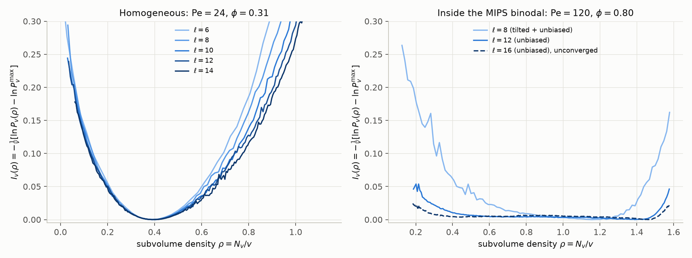

# Results: subvolume-density large deviations in 2D ABPs

Method: [`THEORY.md`](THEORY.md). Code: `abp_ldp/`. Driver and analysis: `scripts/`.

**Setup.**

* Units: `sigma = Dt = mu = 1`, `Dr = 3`, so `Pe = 3 v0 / (sigma Dr) = v0`.
* WCA repulsion.
* A square box of side `L = 3 ell`, so the subvolume fraction `f = v/V = 1/9` is fixed.
* The large parameter is the subvolume area `v = ell^2`. The observable `N_v` is the
  instantaneous particle count, not a time integral.



**Summary.**

* Before phase separation, the volume-scaled rate function `I_v(rho) = -(1/v) ln P_v`
  converges to a strictly convex function with a single minimum at `rho_bar`.
* Inside the MIPS binodal it flattens to zero between the gas and dense branches as `v`
  grows. Densities in that range cost only interfaces, not bulk free energy. The walls remain
  outside the coexistence range.

## 1. Before phase separation: Pe = 24, rho0 = 0.4 (phi = 0.31), eps = 1, dt = 1e-4

This is a homogeneous active fluid, below the MIPS critical activity. Data are in
`results/abp_pe24/`:

* sizes `ell = 6, 8, 10, 12, 14` (`N = 130 ... 706`);
* biasing fields `lambda = -1.25 ... 1.25`;
* `M = 128` replicas, 3 independent replicates per `lambda`;
* tilted ensembles combined with the unbiased histogram by WHAM.


### SCGF

`psi_v(lambda) = (1/v) ln <exp(lambda N_v)>`, from the WHAM normalisation:

| lambda | ell=6 | ell=8 | ell=10 | ell=12 | ell=14 | v -> inf |
|---|---|---|---|---|---|---|
| -1.25 | -0.287 | -0.277 | -0.266 | -0.259 | -0.256 | -0.23 ± 0.01 |
| -1.00 | -0.254 | -0.246 | -0.237 | -0.232 | -0.228 | -0.205 ± 0.01 |
| -0.50 | -0.159 | -0.154 | -0.151 | -0.150 | -0.148 | -0.140 ± 0.002 |
| -0.25 | -0.089 | -0.087 | -0.086 | -0.086 | -0.085 | -0.082 ± 0.001 |
| +0.25 | 0.113 | 0.115 | 0.117 | 0.118 | 0.121 | 0.124–0.136 |
| +0.50 | 0.252 | 0.261 | 0.273 | 0.277 | 0.287 | 0.30–0.35 |
| +1.00 | 0.607 | 0.642 | 0.681 | 0.706 | 0.728 | 0.81–0.91 |
| +1.25 | 0.814 | 0.870 | 0.922 | 0.956 | 0.989 | 1.11–1.22 |

How to read the `v -> inf` column:

* **Dilute side (`lambda <= 0`).** The limits are robust: linear-in-`1/ell` fits (all sizes,
  or `ell >= 8`) and a quadratic fit agree to within about 0.01. The rate function for
  `rho < rho_bar` has collapsed by `ell = 14`.
* **Dense side (`lambda > 0`).** `psi_v` and the tilted densities are still growing with `ell`.
  For example `rho_{lambda=0.25}` goes `0.51, 0.52, 0.54, 0.55, 0.58`. So only a range is given,
  between the linear and quadratic `1/ell` fits.

The slow convergence reflects activity-enhanced density correlations (clustering) and, at
`rho > ~0.85`, the approach to freezing.

### Fluctuations

`Var(N_v)/v = 0.38, 0.45, 0.48, 0.56, 0.54`. It levels off around 0.55, which is 1.5 times
the ideal value `rho_bar (1 - f) = 0.36`.

### Checks

* `<N_v>/v = rho_bar` to within 1% at every size.
* Thermodynamic integration of the tilted means agrees with WHAM `ln Z` to within 0.6.
* `ln P_v` rebuilt from the tilted ensembles alone matches unbiased histograms to within
  about ±0.5 (mostly ±0.25) over their common range (`fig_validation.png`, left).
* **Exact test.** For non-interacting ABPs (`results/ideal/`, same protocol and sizes,
  `lambda = -1.5 ... 1.5`) the exact binomial `ln Z` is reproduced:
  * the direct SMC estimate is within 0.1 for `|lambda| <= 0.5`;
  * WHAM is within 0.5 for `|lambda| <= 1` at all sizes except `ell = 12` at `lambda = 0.75, 1`
    (`-0.65 ± 0.5` and `-1.2 ± 0.8`), i.e. at most about 0.008 in `psi_v`;
  * for `lambda >= 1.25`, where `rho_lambda >~ 2.5 rho_bar`, both estimates drift low by
    1.4–3.6, which is at most about 2% of `ln Z` (`fig_validation.png`, right).
* At the largest tilts the direct SMC `ln Z` is biased low by finite-population
  (weight-degeneracy) effects. The analysis flags these runs with convexity and WHAM checks
  and uses the WHAM normalisation instead.

## 2. Inside the binodal: Pe = 120, phi = 0.8 (rho0 = 1.019), eps = 1, dt = 2e-5

This state point lies deep in the MIPS coexistence region. The system separates into dense,
hexagonally ordered domains and gas bubbles (`results/mips_pe120_phi08/fig_snapshots.png`).

**Choosing the state point.** Coexistence needs boxes larger than the persistence length
`v0/Dr = 40 sigma`: `L = 24` is marginal and `L >= 36` is clear. At `rho0 = 0.6`
(`phi = 0.47`, Pe = 100) the system did not phase-separate in boxes up to `L = 72` on the
simulated timescale.


### Data

* Unbiased sampling over all 9 tiled placements of the subvolume for `ell = 8, 12, 16`
  (`L = 24, 36, 48`), in `results/mips_pe120_phi08/`.
* At `ell = 8`, Doob-guided tilted SMC for the tails, `lambda = -1, -0.5, -0.25, 0.25, 0.5, 1`,
  with `M = 64` and 2 replicates, in `results/mips_pe120_phi08_tilted/`. Combined with its own
  unbiased window, it matches the independent long unbiased run to within 0.01–0.03 in `I_v`
  over their overlap.

### Results

* **Bulk-scaled LDF flat between the binodals.** `ln P_v` is flat to within about 1 over
  `0.45 <~ rho <~ 1.45` at `ell = 12`. So `I_v(rho) = -(1/v) ln P_v` is below 0.01 there and
  decreases with `v` (`ell = 16`: below 0.007 over `0.3 <~ rho <~ 1.5`).
  * Subvolume densities between the gas and dense branches cost interfacial (`O(ell)`) or
    smaller terms, not bulk `O(v)` terms.
  * Correspondingly `Var(N_v)/v = 3.1, 16.4, 33` grows with `v` instead of converging.
* **Walls outside coexistence**, from the `ell = 8` tilted ensembles:
  * Compressing beyond the dense branch is steep: `I_8 = 0.05` at `rho = 1.44` and `0.13`
    at `rho = 1.56`.
  * Rarefying below the gas side rises gradually: `I_8 = 0.14` at `rho = 0.25` and `0.26`
    at `rho = 0.12`.
  * With these soft particles (`eps = 1`) the dense-branch density grows with system size,
    from about 1.25 (`L = 24`) to about 1.45 (`L = 36-48`).
* **Kinked SCGF.** The tilted mean density jumps from `rho_lambda = 0.49` (`lambda = -0.25`)
  to `1.35` (`lambda = +0.25`). This is the finite-`v` precursor of a kink in `psi(lambda)` at
  `lambda = 0`: `psi'(0^-) = rho_gas` and `psi'(0^+) = rho_dense`. It is the Legendre dual of
  the flat rate function, and the hallmark of phase coexistence. Exponential tilting therefore
  samples only the two branches, not the plateau. Inside the plateau the unbiased data are
  what matter.

### Limitations

* The subvolume density relaxes slowly, because bubbles must move or re-form:
  `tau_v ~ 0.6-0.9, 7, ~40` for `ell = 8, 12, 16`.
* `ell = 16` is therefore *unconverged* (dashed in the summary figure), and the unbiased
  statistics at `ell = 12` correspond to a few dozen independent bubble configurations.
* The tilted runs at `ell = 8` have strongly degenerate populations at `lambda = -1, +0.5, +1`
  (2–3 ancestors), so the far tails there carry errors of order 0.02–0.05 in `I_8`.
* Larger boxes and longer runs, e.g. on a cluster, would sharpen the plateau and resolve
  the binodal densities.

## Reproduce

```bash
python scripts/run_subvolume_ldp.py --out results/abp_pe24 --ells 6 8 10 12 14
python scripts/run_subvolume_ldp.py --preset ideal --out results/ideal --ells 6 8 10 12 14 \
       --biasing -1.5 -1.25 -1.0 -0.75 -0.5 -0.25 0.25 0.5 0.75 1.0 1.25 1.5
python scripts/run_subvolume_ldp.py --preset mips --out results/mips_pe120_phi08 --ells 8 12 16 \
       --M 16 --R 1 --n-extra 4 --no-smc --t-burn 6 --t-prod 8 --t-prod-max 16
python scripts/run_subvolume_ldp.py --preset mips --out results/mips_pe120_phi08_tilted --ells 8 \
       --M 64 --R 2 --n-extra 16 --biasing -1 -0.5 -0.25 0.25 0.5 1 --t-burn 6 --t-prod 2 --t-prod-max 8
python scripts/analyze_subvolume_ldp.py results/abp_pe24 --ideal results/ideal
python scripts/analyze_subvolume_ldp.py results/mips_pe120_phi08
python scripts/analyze_subvolume_ldp.py results/mips_pe120_phi08_tilted
python scripts/plot_two_regimes.py results/abp_pe24 results/mips_pe120_phi08 \
       --tilted results/mips_pe120_phi08_tilted --out results/fig_two_regimes.png
```

The MIPS `ell = 8/12/16` runs above used `--M 32/16/8` replicas respectively.
