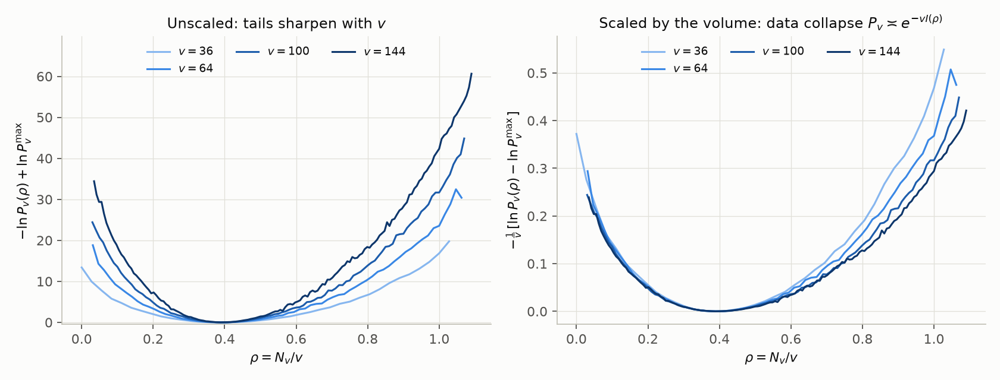
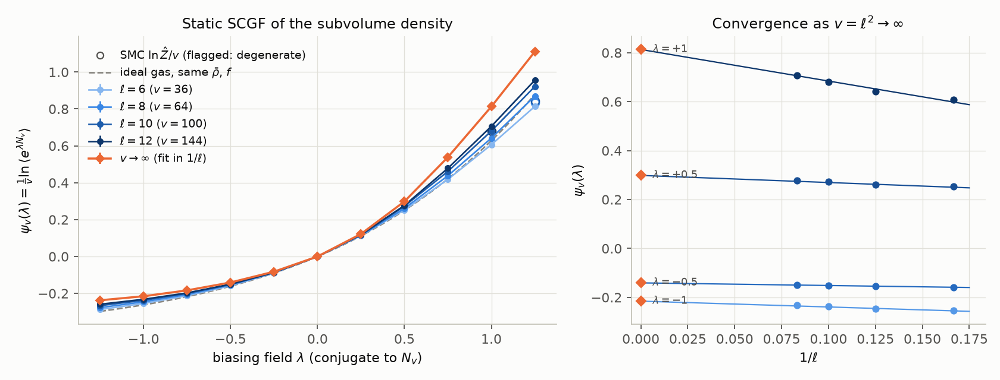
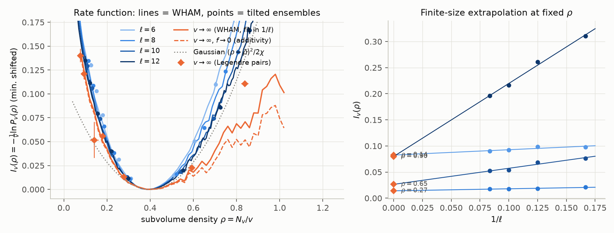
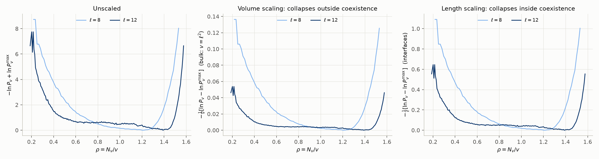

# Results: subvolume-density large deviations in 2D ABPs

**Status: intermediate.** These results are being extended:

* the homogeneous state is getting `ell = 14`;
* the coexistence state is getting `ell = 16`, plus tilted runs for the tails beyond the binodals;
* a non-interacting validation set is queued.

This file and the figures will be updated when those runs finish.

Method: [`THEORY.md`](THEORY.md). Code: `abp_ldp/`. Driver and analysis: `scripts/`.

All runs use units `sigma = Dt = mu = 1` and `Dr = 3` (so `Pe = 3 v0 / (sigma Dr) = v0`),
WCA repulsion, and a square box of side `L = 3 ell`. The box therefore holds the subvolume
fraction fixed at `f = v/V = 1/9`. The large parameter is the subvolume area `v = ell^2`.

## 1. Before phase separation: Pe = 24, rho0 = 0.4 (phi = 0.31), eps = 1, dt = 1e-4

This is a homogeneous active fluid below the MIPS critical activity. Data are in
`results/abp_pe24/`:

* sizes `ell = 6, 8, 10, 12` (`N = 130 ... 518`);
* biasing fields `lambda = -1.25 ... 1.25`;
* `M = 128` replicas, 3 independent replicates per `lambda`.



**Volume scaling.** The unscaled `-ln P_v` grows with `v`. Dividing by `v` collapses it on
the dilute side (`rho < rho_bar`). On the dense side the collapse is slower: there are visible
`O(1/ell)` corrections, with `I_v(0.9) = 0.31, 0.26, 0.22, ...` for `ell = 6, 8, 10`. The
probabilities reached go down to `e^-45`.




**SCGF.** `psi_v(lambda) = (1/v) ln <exp(lambda N_v)>`. The values below use the WHAM
normalisation, with errors from independent replicates. The last column is a linear fit in
`1/ell` and is tentative for `lambda >~ 0.75`, where the dense-side corrections are still
large.

| lambda | ell=6 | ell=8 | ell=10 | ell=12 | 1/ell fit |
|---|---|---|---|---|---|
| -1.00 | -0.254 | -0.246 | -0.237 | -0.232 | -0.215 |
| -0.50 | -0.159 | -0.154 | -0.151 | -0.150 | -0.141 |
| +0.50 | 0.252 | 0.261 | 0.273 | 0.277 | 0.298 |
| +1.00 | 0.607 | 0.642 | 0.681 | 0.706 | 0.81 (tentative) |

**Checks.**

* `<N_v>/v` reproduces `rho_bar` to within 1% at every size.
* Thermodynamic integration of the tilted means agrees with the WHAM `ln Z` to within 0.4.
* `ln P_v` rebuilt from the tilted ensembles *alone* agrees with unbiased histograms to
  within about ±0.3 over their common range (`fig_validation.png`).
* At the largest tilts (`lambda = 1.25`, `ell >= 8`) the direct SMC estimator of `ln Z` is
  biased low by finite-population effects. The analysis detects this (convexity and WHAM
  cross-checks) and uses the WHAM normalisation instead.

**Physics.**

* The rate function is asymmetric:
  * emptying the subvolume (`rho -> 0`) costs `I(0) ~ 0.25-0.35` per unit area;
  * compressing it is steep, because of excluded volume.
* `Var(N_v)/v` rises with `ell`: 0.38, 0.45, 0.48, 0.56 for `ell = 6 ... 12`. This exceeds the
  ideal value `rho_bar (1 - f) = 0.36`. Density correlations in the active fluid are long
  ranged at these sizes, which is consistent with Pe = 24 being on the way to MIPS.

## 2. Inside the binodal: Pe = 120, phi = 0.8 (rho0 = 1.019), eps = 1, dt = 2e-5

This state point is deep in the MIPS coexistence region (suggested parameters). The system
phase-separates into dense, hexagonally ordered domains and gas bubbles.
`fig_snapshots.png` shows the subvolume, in orange, sitting on a bubble.

A pilot showed that coexistence needs boxes larger than the persistence length
`v0/Dr = 40`; `L = 24` is marginal and `L >= 36` is clear. At `rho0 = 0.6` (`phi = 0.47`,
Pe = 100) the system does not phase-separate in boxes up to `L = 72` on the simulated
timescale. Unbiased sampling (all 9 tiled placements of the subvolume) is used here, because
between the binodals density fluctuations cost only interfaces. Data are in
`results/mips_pe120_phi08/`, for `ell = 8, 12`.



**Results.**

* `P_v` is extremely broad. `Var(N_v)/v = 3.1` (`ell = 8`) and `16.4` (`ell = 12`), compared
  with 0.4–0.6 in the homogeneous fluid. This variance grows with `v` instead of
  converging, which is the hallmark of coexistence.
* For `ell = 12`, `ln P_v` is flat to within about 1 over `0.45 <~ rho <~ 1.46`. The volume-scaled
  rate function `-(1/v) ln P_v` is therefore below 0.01 there and decreases with `v`. So the
  large-deviation function **inside the binodal is flat (zero)** between the gas and dense
  branches: subvolume densities in this range cost only interfacial (`O(ell)`) or smaller
  terms, not bulk `O(v)` terms.
* Outside the plateau, the walls are:
  * a steep one at the dense-phase density (`rho ~ 1.3` for `L = 24`, `rho ~ 1.5` for
    `L = 36`; with soft particles the dense phase is more compressed in larger systems);
  * a gradual one toward the gas density (`rho ~ 0.2`).
* The subvolume density relaxes slowly (`tau_v ~ 7` at `ell = 12`) because bubbles must move
  or re-form. Unbiased statistics are therefore limited (tens of independent bubble
  configurations per size), and the low-density tail is noisy.

## Reproduce

```bash
python scripts/run_subvolume_ldp.py --out results/abp_pe24 --ells 6 8 10 12 14
python scripts/run_subvolume_ldp.py --preset mips --out results/mips_pe120_phi08 --ells 8 12 16 \
       --M 16 --R 1 --n-extra 4 --no-smc --t-burn 6 --t-prod 8 --t-prod-max 16
python scripts/analyze_subvolume_ldp.py results/abp_pe24
python scripts/analyze_subvolume_ldp.py results/mips_pe120_phi08
```
